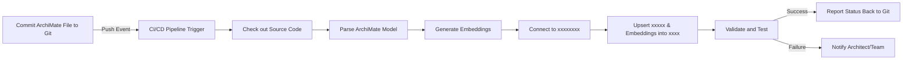

I'm not an entrprising man, I'm an enterprise, man.

```mermaid
flowchart LR

A[Commit ArchiMate File to Git] -->|Push Event| B[CI/CD Pipeline Trigger]
B --> C[Check out Source Code]
C --> D[Parse ArchiMate Model]
D --> E[Generate Embeddings]
E --> F[Connect to xxxxxxxx ]
F --> G[Upsert xxxxx & Embeddings into xxxx]
G --> H[Validate and Test]
H -->|Success| I[Report Status Back to Git]
H -->|Failure| J[Notify Architect/Team]

```

You know what I'm sayin?
