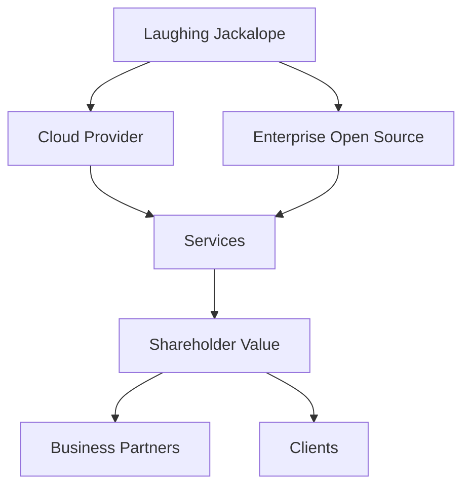

What is a laughing jackalope?
=============================
The laughing jackalope is a mythical creature that is a cross between a jackrabbit and an antelope. It is said to be a mischievous creature known for its ability to mimic human laughter. The legend of the laughing jackalope is said to have originated in the American Southwest, particularly in the states of Arizona and New Mexico. The creature is often depicted as having the body of a jackrabbit and the antlers of an antelope, with a mischievous grin on its face. While the laughing jackalope is not a real animal, it has become a popular figure in American folklore and is often used as a symbol of the American West. They chitter when nervous, but their mischief is of a good nature so this nervous state is a primal form of human laughter.

All of these websites need handles and branding across platforms is tedious so I borrow from the world around me and that one metal gear game with the [skyhook]([https://www.cia.gov/legacy/museum/artifact/skyhook-extraction-mechanism-instructions). How'd they name all those guys? That's how I'm making up my account names. Laughing Jackalope happens to also be the name of a bar in Las Vegas, Nevada. I've never been there. It's been closed for a long time. Maybe I'll get rich as a developer and buy it. That's the larger idea behind choosing this handle. 

I'm not a jackalope, but I do like to laugh. It's close enough for me. You know what I'm sayin?

My commit history on this account won't tell you much, I do a lot of ugly coding to build a cloud provider and that's on the private. Right now private is main and public is alt, we're going to switch that around real soon. As that happens you'll see a number of enterprise open source projects on my pinned page. 

These are the projects I'm working with to provide shareholder value to my business partners and clients. 

You know what I'm sayin?